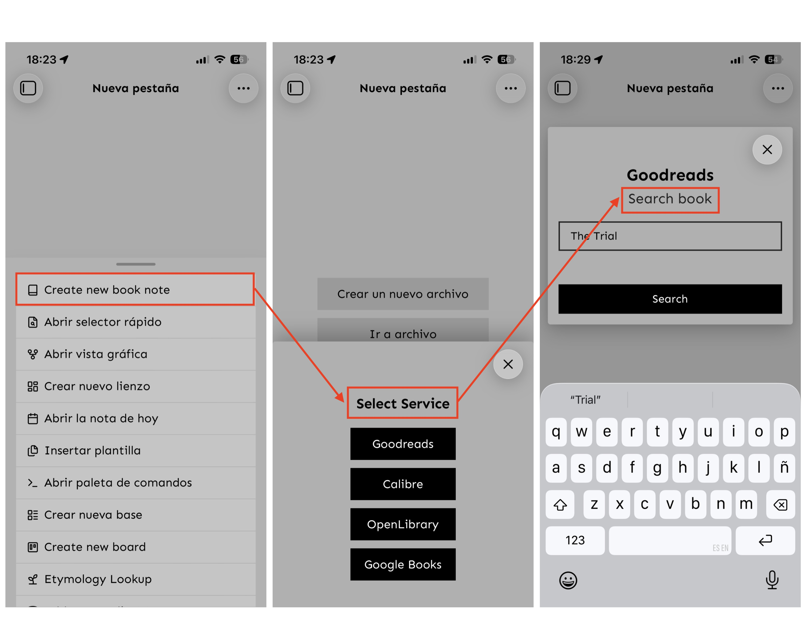

# Book Search Plus


[](https://ko-fi.com/ducktapekiller)

**Book Search Plus** is a plugin for Obsidian that allows you to search for books and create notes with rich metadata. It supports multiple providers, including **Goodreads** (via scraping), **OpenLibrary** (public API), **Calibre** (local library), and **Google Books**.

This version features a **refined UI**, **smart tag generation**, and enhanced customization options.

This plugin is based on the plugin [obsidian-book-search-plugin](https://github.com/anpigon/obsidian-book-search-plugin) by [anpigon](https://github.com/anpigon).

## Features

*   **Unified Service Selection**: Quickly choose your source from a compact, aesthetic modal:
    *   **Goodreads**: Scrapes detailed metadata including **Original Title**, **Page Count**, and **ASIN**.
    *   **Calibre**: Connects to your local library to import books you own.
    *   **OpenLibrary**: Fetches open-source book data.
    *   **Google Books**: The classic search provider.
*   **Smart Tag Generation**: Automatically generates tags based on the author and title in `snake_case` (e.g., `ernest_hemingway`, `for_whom_the_bell_tolls`).
*   **YAML List Support**: Tags are automatically formatted as correct YAML lists.
*   **Template Flexibility**: Supports custom frontmatter templates with extensive variables.
*   **Clean UI**: Polished, theme-adaptive styling.

## Calibre Setup

To search your local Calibre library:

1.  Open **Calibre**.
2.  Go to **Preferences** > **Sharing** > **Sharing over the net**.
3.  Click **Start Server**.
4.  Note the **Port** (default `8080`) and ensure it matches the plugin settings.

## Frontmatter & Templates

The plugin inserts metadata into your notes using **Handlebars** syntax (e.g., `{{title}}`). You can customize this in the settings.

### Default Behavior (Raw Data)

If you leave the "Frontmatter" field in settings **empty**, the plugin will insert **all** available metadata fields it finds (e.g., `subtitle`, `authors` array, `previewLink`, etc.). This is useful if you want to see everything the service provides.

### Recommended Template

To keep your metadata clean and organized, we recommend using a specific template. Below is a standard **English** configuration. Copy this into the "Frontmatter" text area in settings:

```yaml
---
title: "{{title}}"
author: "{{author}}"
publisher: "{{publisher}}"
isbn: "{{isbn13}}"
pages: "{{totalPage}}"
publish_date: "{{publishDate}}"
cover: "{{coverUrl}}"
tags: {{tags}}
description: "{{description}}"
created: "{{DATE}}"
read: false
---
```

### Custom Templates

If you want to create your own template, you can put ANY text you want in the "Frontmatter" text area in settings. Use the following variables to inject data:

#### Available Variables

*   `{{title}}` - Book Title
*   `{{originalTitle}}` - Original Title (Goodreads only)
*   `{{author}}` - Author Name
*   `{{description}}` - Book Summary
*   `{{publisher}}` - Publisher Name
*   `{{category}}` - Genre/Category
*   `{{publishDate}}` - Date of publication
*   `{{totalPage}}` - Number of pages
*   `{{coverUrl}}` - URL of the cover image
*   `{{localCoverImage}}` - Path to the saved local cover image
*   `{{isbn10}}` - 10-digit ISBN
*   `{{isbn13}}` - 13-digit ISBN
*   `{{asin}}` - Amazon Standard Identification Number
*   `{{tags}}` - Automatically generated tags (`author_name`, `book_title`)

#### Important Note on Tags

When adding tags to your template, **you MUST wrap the variable in quotes**.

**Correct Usage:**
```yaml
tags: "{{tags}}"
```

**Why?**
Obsidian's frontmatter (and the Properties view) considers `{{tags}}` invalid syntax if it is not wrapped in quotes. If you try to use it without quotes, the value may disappear or be deleted by Obsidian.

**How it works:**
Even though you write `"{{tags}}"`, the plugin is smart enough to detect this. It will automatically **remove the quotes** and format the result as a valid YAML list:

*Result in your note:*
```yaml
tags:
  - tag_one
  - tag_two
```

**MOBILE**




**CALIBRE**

https://github.com/user-attachments/assets/0df6fe0e-bf15-4568-8bb8-3d4a1f252737

**GOODREADS**

https://github.com/user-attachments/assets/c75e9fd9-b2ac-4555-a64e-d3710f9d6375


## Credits

By **DuckTapeKiller**.
